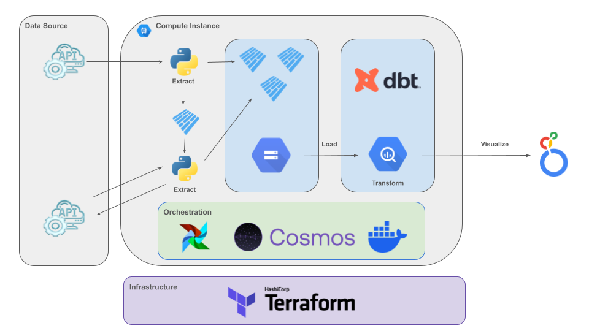
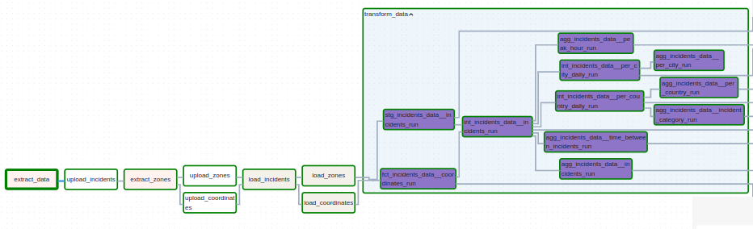
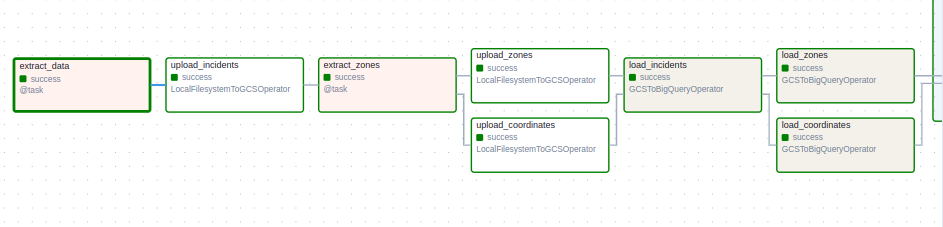
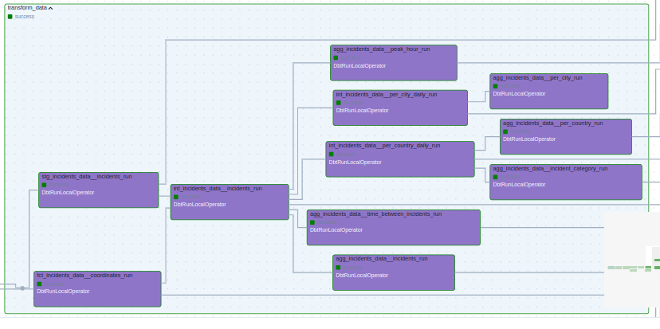

# Traffic Incidents ELT Data Pipeline

## Project Overview

Traffic incidents occur daily across various regions, impacting commuters, urban planning, and emergency response strategies. To gain better insights into these incidents, we need a robust data pipeline capable of efficiently collecting, processing, and analyzing incident data at scale.

However, raw incident data is fragmented and retrieved through an API that requires bounding box coordinates for querying. Additionally, the data lacks proper structuring for analytical workloads. This project addresses these challenges by developing a cloud native end-to-end ELT pipeline that automates data ingestion, transformation, and visualization, enabling efficient analysis of traffic incidents.

## Tech Stack & Tools

This project is designed as a cloud-native, scalable, and fully automated data pipeline:

1. Cloud Infrastructure

    - Google Cloud Platform (GCP) : Fully cloud-based architecture
    - Google Cloud Storage (GCS) : Data lake for parquet data storage and source code deployment
    - Google Compute Engine (GCE) : Hosting Airflow for pipeline orchestration
    - BigQuery : Cloud-based data warehouse optimized for analytical workloads
    - Terraform : Infrastructure as Code (IaC) to provision and manage all cloud resources, including storage buckets, compute instances, cloud functions and firewall rules

2. Workflow Orchestration

    - Apache Airflow : End-to-end orchestration of the ELT process using DAGs
    - Cosmos : Open-source framework designed to integrate Airflow and dbt for seamless transformation execution

3. Data Processing & Ingestion

    - Python : Core programming language for data exctraction and processing
    - Polars : High-performance data manipulation library for fast transformations and data flattening 
    - Multithreading : Optimized API querying for parallelized data retrieval
    - Folium & Shapelt : Converting coordinates into plotted locations on an interactive map
    - Cosmos : Enabling interaction between Apache Airflow and dbt

4. Data Transformation 

    - dbt (Data Build Tool) : Automated SQL-based transformations in BigQuery, ensuring structured and optimized data models

5. Visualization

    - Looker : Cloud-native BI platform for interactive data visualization

## Data Used  
This dataset contains **reported traffic incidents**, including details such as **incident type, severity, location, and timestamps**. The data is retrieved using the **TomTom Traffic Incidents API**, which provides real-time and historical incident reports based on predefined geographical bounding boxes (bboxes).

To enrich the dataset with human-readable locations, the **LocationIQ API** is used for **reverse geocoding**, converting raw latitude and longitude coordinates into city names, street names, and administrative regions.

By integrating these APIs, the pipeline ensures a structured and enriched dataset.

## Pipeline Overview

The pipeline follows a structured ELT (Extract, Load, Transform) workflow, ensuring efficient data ingestion,
transformation, and visualization:


### 1. Data Ingestion

- Geodata partitionning as a prerequisite, traffic incident data is retrieved using API calls that require predefined bounding boxes ([documentation](./docs/prerequisites/README.md)).
- BBox Optimization: Large country-wide bboxes are split into sub-bboxes of 10,000 km² to comply with API constraints.
- Parallel API Requests: Using multithreading, the system efficiently queries the API for incidents across multiple bboxes.
- Extracted data is split into incidents metadata and coordinates data both saved as parquet files.
- API Based Reverse Geocoding is applied to coordinates data constituting a zones lookup table for downstream optimizations.
- Raw data is stored in Data lake.

### 2. Data Loading

- Data is transferred from GCS to BigQuery, ensuring efficient storage for analytical queries.

### 4. Data Transformation with dbt

- Data Transformation :

    - SQL-Based Transformations
    - Data enrichment
    - Data cleaning
    - Aggregations

- Partitioning & Clustering for Performance Optimization:

    - Partitioning: Tables are partitioned by incident start_time to improve query efficiency, allowing BigQuery to reduce data scans to relevant partitions.
    - Clustering: Tables are clustered by country, incident_cause and magnitude_of_delay which are frequently filtered to optimize storage and retrieval speeds.

### 5. Data Visualization

- Looker Dashboard: A dashboard is created in Looker with interactive visualizations

*NB : Orchestration with Cosmos & Airflow: dbt runs within Airflow via Cosmos, ensuring automated execution within DAGs*



## Build Instructions

Follow the steps below to set up, run, and monitor the Traffic Incidents ELT Data Pipeline. 
Assuming you have access to the necessary cloud resources and API keys.

or

Set up the project with Make, just make sure to provide correct information

```bash
# Build the project
make build

# Destroy the project 
make destroy
```

### Prerequisites

- **Google Cloud Platform (GCP) account** with permissions to create and manage resources (BigQuery, GCS, Compute Engine, etc.)
- **Google Cloud Platform (GCP) serviceaccount** key downloaded in your local machine
- **Terraform** installed for Infrastructure as Code (IaC) provisioning
- **Python 3.x** installed along with required libraries (polars, folium, shapely)

### 1. Clone the Repository

Start by cloning the repository to your local machine:

``` bash
git clone https://github.com/yz-jz/Traffic-incidents-ELT-pipeline.git
cd Traffic-incidents-ELT-pipeline
```

then move your serviceaccount.json to Traffic-incidents-ELT-pipeline/

### 2. Generate SSH key
You need to generate an SSH key in order to connect to the GCP compute instance provided with terraform (this key will be passed to terraform file from env variables)

``` bash
ssh-keygen -t rsa -b 4096 -C "user"
```

### 3. Set Up Environment Variables

Terraform picks up different variables necessary for deployment from your environment, this way ensures you don't have to modify different files in order to make this work. ([documentation](./docs/terraform/README.md))
(Ensure that all variables have TF_VAR prefix)

 - In your terminal :

    ``` bash
    export TF_VAR_gcp_key=path/to/service_account.json
    export TF_VAR_service_account=serviceaccount # the part of email before '@' provided by gcp in IAM & admin/serviceaccounts
    export TF_VAR_project_id=your_project_id
    export TF_VAR_region=region_of_your_choice
    export TF_VAR_zone=zone_of_your_choice
    export TF_VAR_ssh_user='airflow'
    export TF_VAR_ssh_key=path/to/ssh_public_key.pub
    export TF_VAR_ip_address=your_public_ip_address # Used to access airflow UI through ssh tunnel
    export TF_VAR_deployment_bucket_name=your_bucket_name # Must be unique
    export TF_VAR_datalake_bucket_name=your_bucket_name2# Must be unique
    export TF_VAR_dataset_name=your_dataset_name
    ```
 - Create file src/airflow/.env : 

    This file will be picked up by docker container and will provide necessary variables for cosmos (airflow & dbt)

    ```bash 
        TOMTOM_KEY=YOUR_TOMTOM_ACCESS_KEY
        LOCATIONIQ_KET=YOUR_LOCATIONIQ_ACCESS_KEY

        BUCKETNAME=YOUR_BUCKER_NAME
        DATASET_NAME=YOUR_DATASET_NAME

        AIRFLOW_CONN_GOOGLE_CLOUD_DEFAULT=google-cloud-platform://?extra__google_cloud_platform__project={YOUR_PROJECT_ID}&extra__google_cloud_platform__key_path=/usr/local/airflow/k.json

        DBT_BIGQUERY_PROJECT=YOUR_PROJECT_ID
        DBT_BIGQUERY_DATASET=YOUR_DATASET_NAME
    ```

### 4. Set Up Cloud Infrastructure

Terraform is used to manage the pipeline's infrastructure, running the following commands will provision all the necessary components to make it work with minimal set-up.

First start by zipping the src/ folder, terraform will upload it to a bucket then provision a compute instance with a startup script that will install required dependencies, init cosmos project and start airflow.

``` bash
zip -r src.zip src/airflow
```

Now change directory to terraform/ and run the following commands to create resources :

```bash
cd terraform
terraform init
terraform apply -auto-approve
```

### 5. Trigger DAG

Since your compute instance is running airflow, you can access it via localhost:8080 as terraform has also created a firewall rule to allow tcp traffic to port 8080.
But first run the following command :
```bash
ssh -i /path/to/private_key -L 8080:127.0.0.1:8080 airflow@{IP_address_of_compute_instance}
```
Now you can Run, Visualize and monitor your DAG






