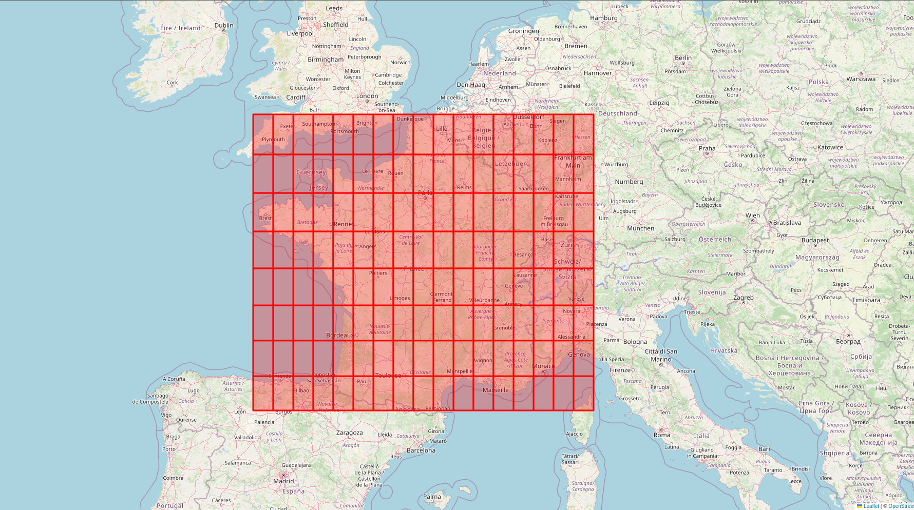
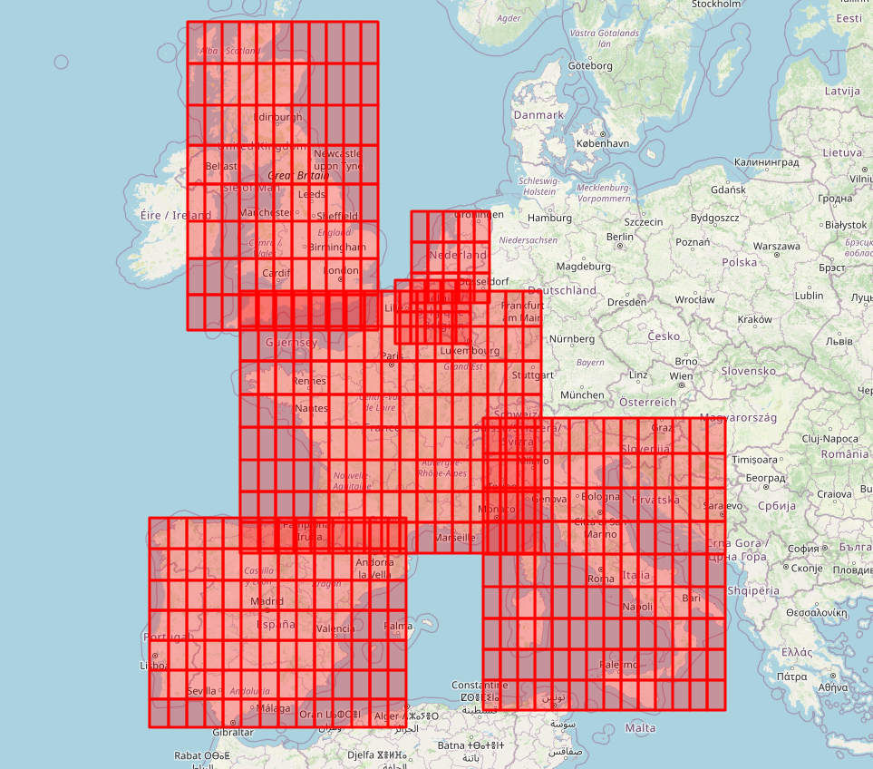
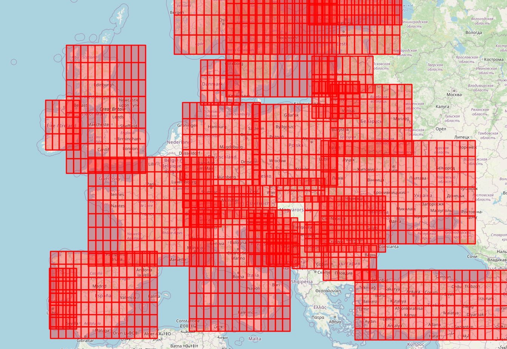

# Sub-Bounding-Box generation
This module is responsible for dividing a given bounding box (a defined geographical area represented by latitude and longitude) into smaller sub-boxes. The sub-division process is useful for splitting large geospatial datasets into smaller chunks, which in this project's context is necessary as querying the api has the following constraints: 
1. The request must have a valid bounding box presented as min_longitude, min_latitude, max_longitude, max_latitude
2. The requested bounding box's total area must not exceed 10 000 KM²

## Approach

### 1. Gathering bounding_box data per country 

Here is a [Country bounding boxes dataset](https://github.com/sandstrom/country-bounding-boxes/blob/master/bounding-boxes.json) available on github.

### 2. Filtering country bounding_box list, keeping countries covered by the API

According to the API documentation the list of the countries it supports is the following :
```python
country_codes = ["EG","KE","LS","MA","MZ","NG","RE","ZA","AR","BR",
                "CA","CL","CO","GP","MQ","MX","PE","US","UY","BH",
                "BN","HK","IN","ID","IL","KZ","KW","MO","MY","OM",
                "PH","QA","SA","SG","KR","TW","TH","AE","VN","AU",
                "NZ","AD","AT","BY","BE","BA","BG","HR","CY","CZ",
                "DK","EE","FI","FR","DE","GI","GR","HU","IE",
                "IT","LV","LI","LT","LU","MT","MC","NL","NO","PL",
                "PT","RO","RU","SM","RS","SK","SI","ES","SE","CH",
                "TR","UA","GB"
]
```
Keeping only those to run against the sub_bbox generator function

### 3. Partitionning a given bounding_box into N boxes of 10 000 KM² area

In order to split a given bounding box into smaller chunks, it is necessary to convert it's coordinates to distance metrics such as KM, to determine height and width of the bounding_box before dividing it into N chunks.
Then coordinates of each bounding box can be deduced.

```python
from math import ceil, sqrt

# Angles to convert lon/lat to km (approximate)
lon_angle = 111
lat_angle = 85

def get_bbox(country: str, min_lon: float, min_lat: float, max_lon: float, max_lat: float) -> list[dict]:
    """Subdivide a given country's bounding box into adjacent sub bounding boxes of 10K km² area limit"""

    width = (max_lon - min_lon) * lon_angle
    height = (max_lat - min_lat) * lat_angle

    # Give number of horizontal and vertical splits of the area dividing it into sub bounding boxes of MAX area = 10K km²
    # adhering to tomtom api requirements
    # dimension / 10 000 km²
    # max (1, x) is used to output one bounding box if the input bbox is 10k or less km²
    x_split = max(1, ceil(width / sqrt(10000)))
    y_split = max(1, ceil(height / sqrt(10000)))

    # Calculate how many units a single sub bounding box has, lon/lat
    lon_step = (max_lon - min_lon) / x_split
    lat_step = (max_lat - min_lat) / y_split

    # Store sub bbox
    boxes = []

    # Generate bounds for each sub bbox
    # Take each min coordinate * n steps to constitute min longitude/latitude
    # Take sub bbox min longitude + 1 step for it's corresponding max longitude/latitude
    for i in range(x_split):
        for j in range(y_split):
            sub_min_step_lon = min_lon + (i * lon_step)
            sub_max_step_lon = sub_min_step_lon + lon_step
            sub_min_step_lat = min_lat + (j * lat_step)
            sub_max_step_lat = sub_min_step_lat + lat_step

            boxes.append(
                {
                    "country": country,
                    "bbox": [
                        sub_min_step_lon,
                        sub_min_step_lat,
                        sub_max_step_lon,
                        sub_max_step_lat,
                    ],
                }
            )
             boxes.append({"country":country,"coordinates": [ sub_min_step_lon,sub_min_step_lat,sub_max_step_lon,sub_max_step_lat ] })
    return boxes
```
### 4. Plot results to check validity of generated data

For plotting the bounding_boxes the following packages are used :

- **Shapely** : Python package for manipulation and analysis of planar geometric objects
- **Folium** : Python package for visualizing data on an interactive leaflet map

```python
def map_bbox(filename: str, bounding_boxes: list[dict]) -> None:
    """Generate an interactive map displaying the area of the provided bounding boxes"""
    import folium
    import shapely

    m = folium.Map()
    for bbox in bounding_boxes:
        print(bbox)
        # Make bbox a box object so folium can process it
        box = shapely.geometry.box(
            bbox["bbox"][0], bbox["bbox"][1], bbox["bbox"][2], bbox["bbox"][3]
        )
        # Add bounding box rectangle to map
        folium.Rectangle(
            # [[SW], [NE]]
            bounds=[
                [box.bounds[1], box.bounds[0]],
                [box.bounds[3], box.bounds[2]],
            ],  
            color="red",
            fill=True,
            fill_opacity=0.3,
        ).add_to(m)
    # Save map to HTML file
    m.save(filename)
```
#### Result of subdividing bounding_box of France displayed on map : 


### 5. Optimize

After plotting multiple countries Sub bounding boxes it is obvious that a lot of them coallide due to the nature of the shape



When plotting more countries the overlap becomes unmanageable like follows :



This means that a lot of sub_bbox will output shared data when queried, thus it needs optimization to reduce duplicates and API calls

The initial approach involved using geopandas to filter out colliding squares but it wasn't successful, thus filtering was manual and less optimized.

Not every Bounding box had valid data as well, since some of them would be on sea or unpopulated areas.

The retained bounding boxes were the ones tested against the API endpoint and yielded valid data.

